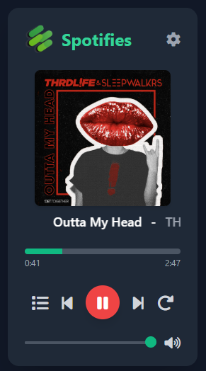

# Spotifies

## Installation
* On ([developer.spotify](https://developer.spotify.com/)) create new app accessing Web API
* Install extension by selecting in chrome extensions **load unpacked**
* Provide Client ID from ([developer.spotify](https://developer.spotify.com/)) in background.js
* Update redirect URL on ([developer.spotify](https://developer.spotify.com/))
* Login via OAuth 2.0